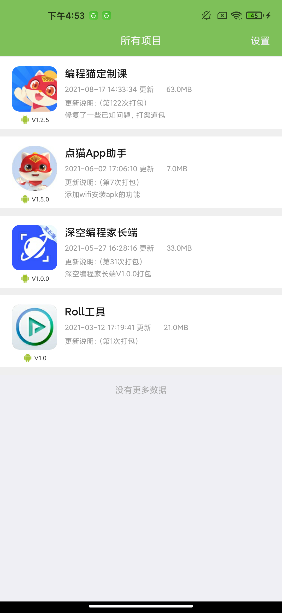

# 安卓App助手

## 背景

因为我们公司旗下app很多个，测试人员在下载新版本进行测试的时候不是很方便，于是在职期间给测试开发了一款App安装工具，旨在加快下载安装新版本的流程，也能更方便的查看和安装历史版本~

## 前提
这个工具会拉取蒲公英平台里面指定token下的app信息，所以如果你们公司的app使用的是蒲公英就可以使用这个东西了~

## 哪些功能？

+ 首页会显示当前账号下所有的app应用信息
+ 置顶app应用信息【将你感兴趣的APP放到最上面，针对应用比较多的账号有帮助，我们的应用就很多】
+ 区分系统版本【Android和iOS都能看，不过只有Android能装上~】
+ 查看某个应用下所有的历史版本
+ 点击安装应用直接进入浏览器开始下载应用，无需输入密码【即使你设置了密码】
+ Wifi 安装应用【在没有数据线的情况下，可以将电脑上的apk文件通过wifi的形式安装到手机上，👍🏻】
+ 安全，app不会收集你的任何信息，代码也开源了；即使不小心泄露了ApiKey，你可以去蒲公英后台重置一下ApiKey，之前的ApiKey就失效了

## 主界面

<div align=center ></div>

## 怎么使用呢？
+ 一、下载项目目录中的apk文件[点我下载](https://raw.githubusercontent.com/MZCretin/CMAppDownload/master/app.apk)，进行安装;

+ 二、打开app，点击右上角设置->绑定appKey;

+ 三、进入 https://www.pgyer.com/ 登录成功之后，点击右上角控制台，进入成功之后，点击右上角你的头像，在下拉菜单中点击api信息，就可以获取到ApiKey信息;

+ 四、将第三步骤中获取到的ApiKey信息填充到数据框点击绑定即可使用了;
   
   + 如果你的手机里面没有微信，钉钉，qq之类的应用，不方便把ApiKey传输到app里面去，我给你一个方法
      
      ```
      进入到绑定ApiKey的页面，点击输入框使其获取焦点；
      将你的手机连接到电脑，保证能正常使用adb功能，在命令行输入以下命令：
      adb shell input text "你的ApiKey"
      ```
      
      